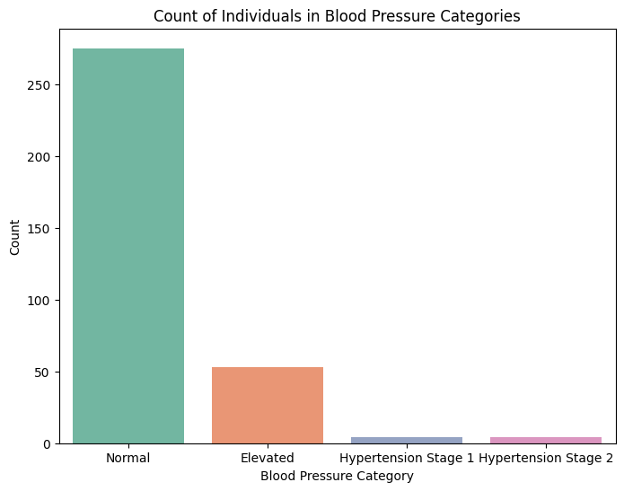
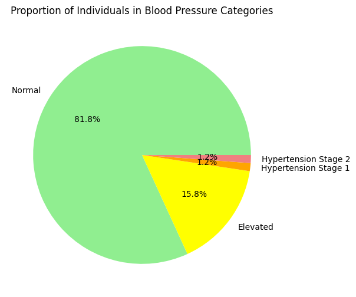
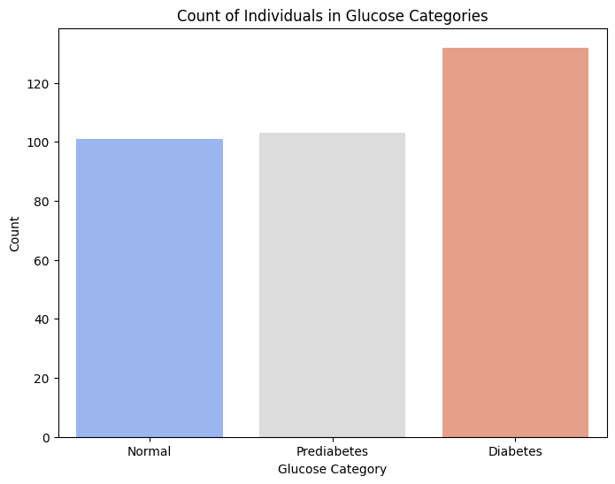
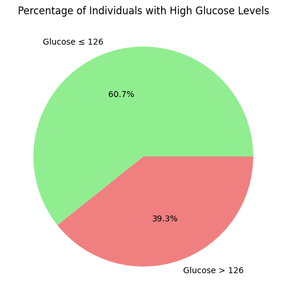

# Diabetes Dataset Analysis

This project is part of my training at the **National Telecommunication Institute (NTI)**. It involves analyzing the **Diabetes Dataset** to explore key factors like BMI, Blood Pressure, and Glucose levels. The goal is to understand how these factors correlate with diabetes outcomes.

---

## **Table of Contents**
1. [Dataset Overview](#dataset-overview)
2. [Data Cleaning](#data-cleaning)
3. [Key Visualizations and Insights](#key-visualizations-and-insights)
4. [Tools Used](#tools-used)
5. [Key Findings](#key-findings)
6. [Why This Matters](#why-this-matters)
7. [Next Steps](#next-steps)

---

## **Dataset Overview**
- **Dataset**: Diabetes dataset with 768 rows and 9 columns.
- **Variables**:
  - `Pregnancies`: Number of times pregnant.
  - `Glucose`: Plasma glucose concentration (mg/dL).
  - `BloodPressure`: Diastolic blood pressure (mm Hg).
  - `SkinThickness`: Triceps skin fold thickness (mm).
  - `Insulin`: 2-Hour serum insulin (mu U/ml).
  - `BMI`: Body mass index (weight in kg/(height in m)^2).
  - `DiabetesPedigreeFunction`: A function that scores the likelihood of diabetes based on family history.
  - `Age`: Age in years.
  - `Outcome`: Class variable (1 = Diabetes, 0 = No Diabetes).

---

## **Data Cleaning**
- **Handled Illogical Values**: Dropped rows containing zero values for key variables like `Glucose`, `BloodPressure`, `SkinThickness`, `Insulin`, and `BMI` to ensure data quality.
- **Result**: Cleaned dataset ready for analysis.

---

## **Key Visualizations and Insights**

### **1. BMI Analysis**
- **Categories**:
  - **Underweight**: BMI < 18.5
  - **Normal weight**: 18.5 ≤ BMI < 25
  - **Overweight**: 25 ≤ BMI < 30
  - **Obese**: BMI ≥ 30
- **Insights**:
  - A significant proportion of individuals are obese or overweight.
  - Obese individuals are more likely to have diabetes.

### **2. Blood Pressure Analysis**
- **Categories**:
  - **Normal**: Diastolic BP < 80 mmHg
  - **Elevated**: 80 ≤ Diastolic BP < 90 mmHg
  - **Hypertension Stage 1**: 90 ≤ Diastolic BP < 100 mmHg
  - **Hypertension Stage 2**: Diastolic BP ≥ 100 mmHg
- **Insights**:
  - Many individuals fall into the elevated or hypertension categories.
  - High blood pressure is associated with a higher likelihood of diabetes.

### **3. Glucose Analysis**
- **Categories**:
  - **Normal**: Glucose < 100 mg/dL
  - **Prediabetes**: 100 ≤ Glucose < 126 mg/dL
  - **Diabetes**: Glucose ≥ 126 mg/dL
- **Insights**:
  - High glucose levels are strongly correlated with diabetes outcomes.
  - Individuals with prediabetes or diabetes make up a significant portion of the dataset.

---

## **Tools Used**
- **Python Libraries**: Pandas, Matplotlib, Seaborn.
- **Environment**: Jupyter Notebook.

---

## **Key Findings**
- **BMI**: Obesity is a major risk factor for diabetes.
- **Blood Pressure**: Elevated and hypertension stages are common among individuals with diabetes.
- **Glucose**: High glucose levels are a strong indicator of diabetes.
- **Correlation**: Glucose levels and BMI have the strongest correlation with diabetes outcomes.

---

## **Why This Matters**
Understanding these factors is crucial for early diagnosis and prevention of diabetes. This analysis highlights the importance of monitoring BMI, blood pressure, and glucose levels for better health outcomes.

---

## **Next Steps**
- Build a predictive model to classify diabetes outcomes.
- Explore additional datasets to validate findings.

---

## **Visualizations**
Here are some of the key visualizations created during the analysis:

### **BMI Categories**

)

)

### **Blood Pressure Categories**



### **Glucose Categories**



---

## **How to Run the Code**
1. Clone the repository:
   ```bash
   git clone https://github.com/your-username/diabetes-analysis.git
